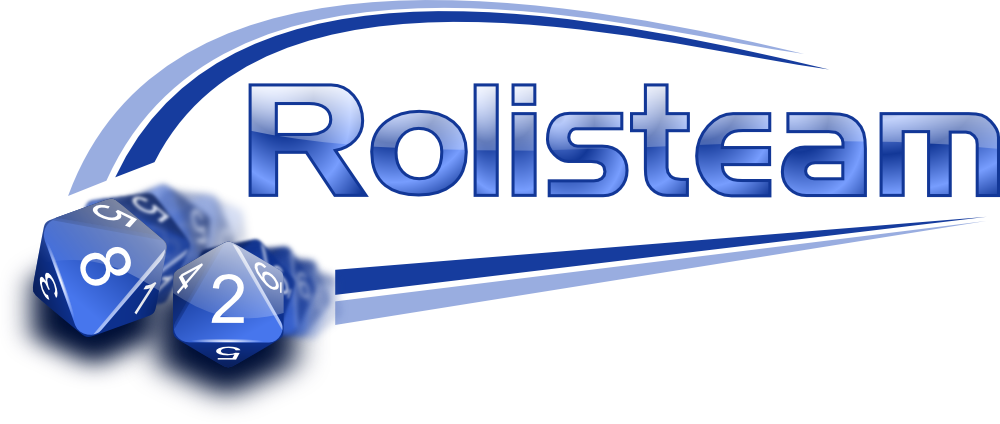

<p align='center'></p>

---

**Table of Contents** &nbsp;&nbsp; [Rolisteam](#rolisteam) | [Downloads](#downloads) | [Get Involved](#get-involved) | [Community](#community) | [Translation](#translation-status) | [Road Map](#road-map) | [License](#license-) | [CI System](https://travis-ci.org/Rolisteam/)

---

# Rolisteam

Rolisteam helps you to manage a tabletop role playing game with remote friends/players. 
It provides many features to share maps, pictures and it also includes tool to communicate with your friends/players. 
The goal is to make Rolisteam-managed RPG games as good as RPG games around your table. 
To achieve it, we are working hard to provide you more and more features. Rolisteam is released under GPLv2.

https://rolisteam.org/

# Compilation

## Requirements

* Qt6.8 or >

## Commands:

```bash
git clone --recursive https://invent.kde.org/rolisteam/rolisteam.git
cd rolisteam
mkdir build
cd build
# Configuration
cmake -S ../ -B . -DQT_QMAKE_EXECUTABLE:FILEPATH=/path/to/qt/version/bin/qmake -DCMAKE_PREFIX_PATH:PATH=/path/to/qt/gcc_64

# build
cmake --build . --target all
```

More information about building Rolisteam, see:

* [windows](https://doc.rolisteam.org/en/windowscomp.html)
* [Mac OS](https://doc.rolisteam.org/en/compmacos.html)
* [Linux](https://doc.rolisteam.org/en/linuxcomp.html)


## Generated Binaries

|Name|description|
|--|--|
|Rolisteam|Main application may be use as client or server|
|rcse|Rolisteam charactersheet editor, use it if you want to create the charactersheet of your game|
|roliserver| CLI application standalone server. Can be use on remote server|
|mindmapbin| Standalone application to create mindmap|
|dice| CLI application to run dice commands|
|tst_\*, manual_\*|tests|

# Downloads

-Latest full release : https://rolisteam.org/download.html

# Get Involved

Remarks and requests ?  Feel free to add a new issues or clone the project and submit some pull requests.
https://invent.kde.org/rolisteam/rolisteam/-/issues

# Community

* [Official Git repo](https://invent.kde.org/rolisteam/rolisteam)
* [Discord](https://discord.gg/MrMrQwX)
* [Mailing list](https://mail.kde.org/mailman/listinfo/rolisteam)
* [Road Map](https://docs.google.com/spreadsheets/d/18jDGViuOm6KjqEAumW1RU2qccQQ4-TxiXPtAg0X_M2o/edit#gid=769324568)

# Documentation

Documentation can be found here : https://doc.rolisteam.org/

# License [](https://github.com/Rolisteam/Rolisteam/blob/master/COPYING)

Rolisteam is free software, licensed under the [GPLv2](https://github.com/Rolisteam/Rolisteam/blob/master/COPYING.txt).
